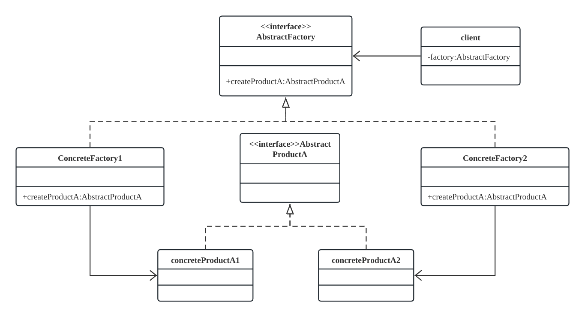
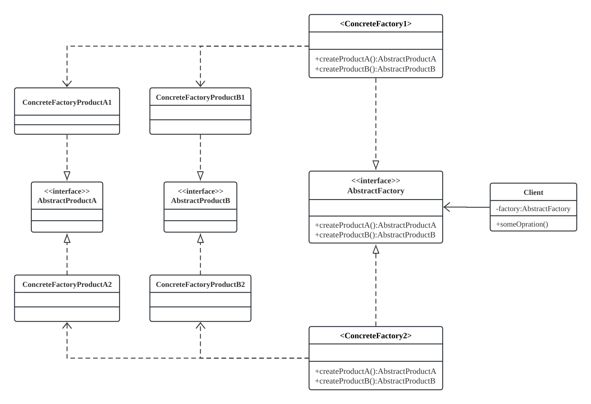
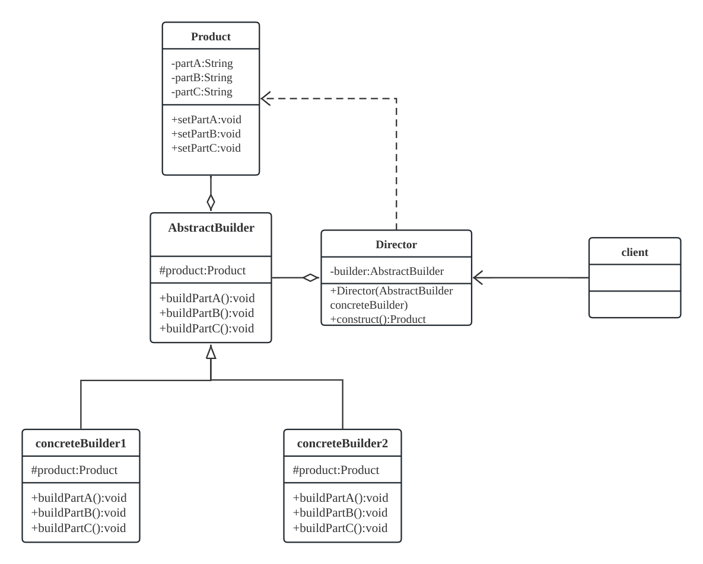
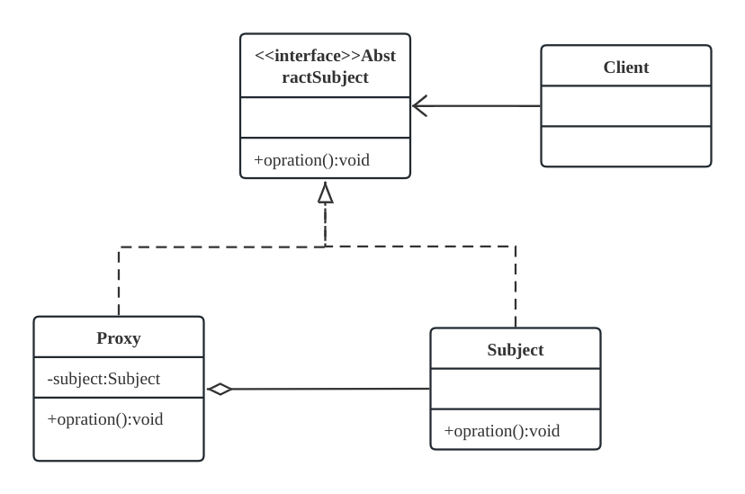
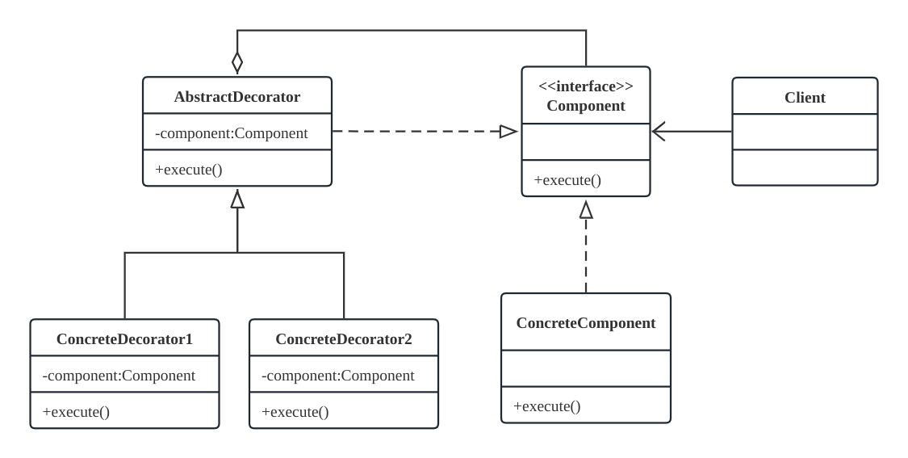
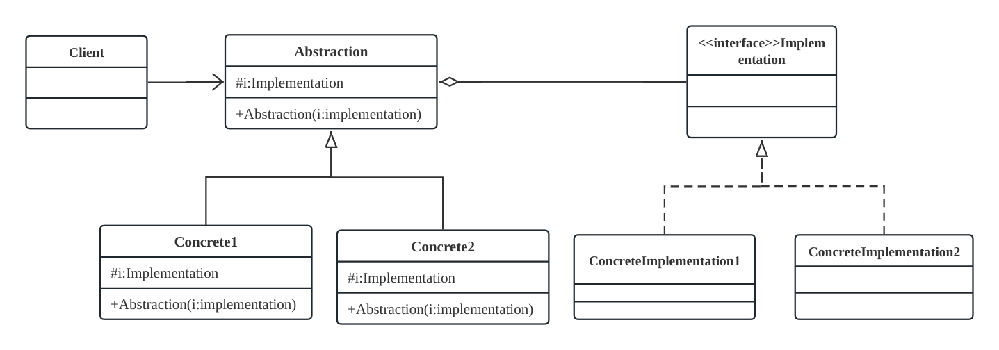
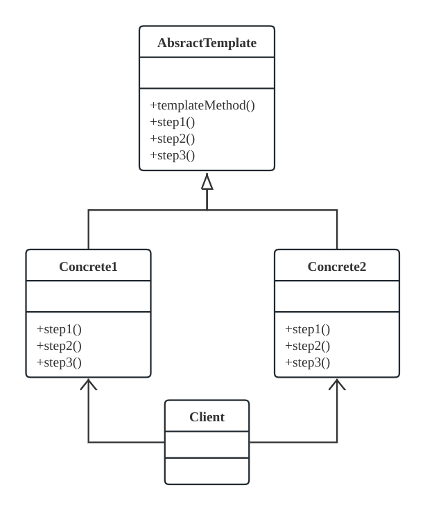
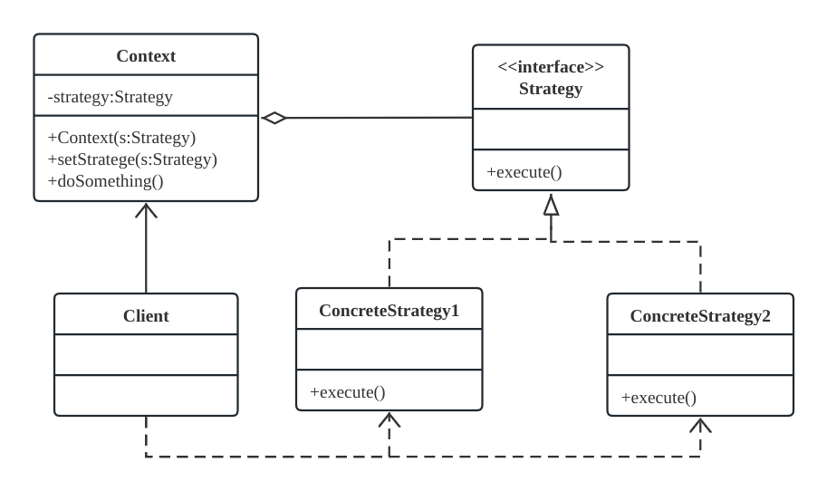
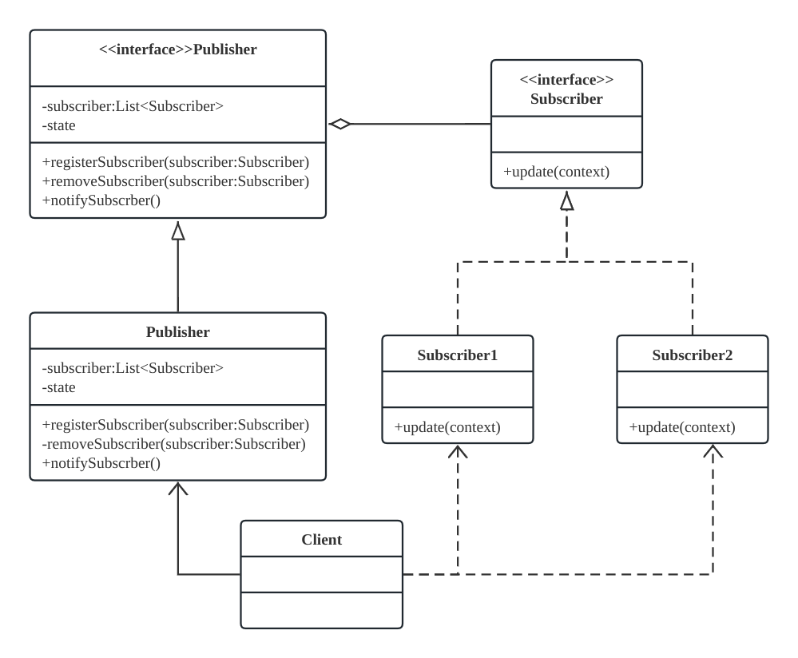

# 软件设计模式 ——Java

## 设计原则

1. *开闭原则*：对扩展开放，对修改关闭
2. *里氏代换原则*：子类可以扩展父类的功能，但不能改变父类原有的功能。即子类应添加新的方法完成新增功能，尽量不重写父类的方法。
3. *依赖倒转原则*：高层模块依赖于抽象而不依赖于具体。对抽象编程而不对实现编程
4. *接口隔离原则*：客户端不应该被迫依赖于它不使用的方法，一个类对另一个类的依赖应该建立在最小的接口上。拆分接口。
5. *迪米特法则*：又叫最小支持原则。降低无关联类之间的耦合，使用中间类作为桥梁
6. *合成复用原则*：尽量优先使用组合或者聚合等关联关系来实现，其次才考虑使用继承关系来实现。

## 创建型

### 单例模式

  破坏单例的方法：
  1. 序列化：
    - 解决方法：
    使用readResolve()方法返回实例，该方法反序列化时会自动调用。
  2. 反射
    - 解决方法：
    判断是否第一次创建可以设置一个标志。

### 工厂模式

是一种创建型设计模式，用于封装对象的创建过程。它通过定义一个创建对象的接口，但将具体对象的实例化延迟到子类或工厂类中。这样可以避免直接在客户端代码中使用 new 关键字来创建对象，从而提高代码的灵活性和可维护性。

#### 简单工厂

 由一个工厂类负责创建多个不同类型的对象。客户端通过工厂类的静态方法来获取所需的对象。

#### 静态工厂

使用静态方法的简单工厂

#### 工厂方法

定义一个抽象的工厂类，具体的对象创建由子类来实现。每个具体子类对应创建一种类型的对象。

#### 抽象工厂

 定义一个抽象的工厂接口，包含多个工厂方法，每个方法用于创建一类相关的对象。具体的工厂子类实现这些工厂方法来创建一组相关的对象（产品簇）。

 抽象工厂模式通常包含以下角色:

1. ` 抽象工厂（Abstract Factory）： `定义一个抽象的接口，该接口包含多个工厂方法，每个方法用于创建一类相关的对象。抽象工厂可以理解为具有多个工厂方法的工厂。

2. `具体工厂（Concrete Factory）：` 实现抽象工厂接口，具体工厂负责创建一组相关的对象。每个具体工厂类对应一种对象族的创建。

3. `抽象产品（Abstract Product）：` 定义一类相关的产品接口，包含多个抽象方法。这些方法声明了产品所具有的操作。

4. `具体产品（Concrete Product）： `实现抽象产品接口，具体产品是抽象产品的具体实现。

抽象工厂模式适用于需要创建一系列相关的对象，且这些对象之间存在着关联或依赖关系。例如，在图形界面库中，可以使用抽象工厂模式来创建不同风格的按钮、文本框等控件，从而确保它们之间的样式一致性。这样的场景下，抽象工厂模式可以提供一种组织和管理对象的方式。

### 建造者模式

是一种创建型设计模式，用于将一个复杂对象的构建过程与其表示分离，以使同样的构建过程可以创建不同的表示。

建造者模式主要包含以下几个关键角色：

1. `产品（Product）：` 要构建的复杂对象，通常由多个部件组成。

2. `抽象建造者（Abstract Builder）：` 定义一个抽象接口，包含构建产品各个部件的方法。

3. `具体建造者（Concrete Builder）：` 实现抽象建造者接口，负责实际构建产品的各个部件，并提供获取产品的方法。

4. `指挥者（Director）：` 负责调用建造者的方法按照一定的顺序构建产品。可以省略，客户端也可以直接调用具体建造者的方法来构建产品。

建造者模式的主要优点是将复杂对象的构建过程与其表示分离，使得构建过程更加灵活，能够根据不同需求创建不同的产品对象。此外，建造者模式还可以避免在客户端代码中直接创建复杂对象的构建过程，使得客户端代码更加简洁，易于理解和维护。

### 原型模式（Prototype Pattern）

是一种创建型设计模式，用于复制已有对象，从而创建新的对象，而无需使用 new 关键字来实例化。原型模式允许我们通过克隆（复制）已有的对象来创建新的对象，这样可以避免重新初始化对象的开销，提高对象的创建效率。

原型模式主要包含以下几个关键角色：

1. `原型接口（Prototype）：` 定义一个克隆自身的方法，通常是一个 clone 方法。

2. `具体原型（Concrete Prototype）：` 实现原型接口的具体类，实现克隆方法来创建新的对象。

3. `客户端（Client）：` 负责创建新对象的客户端代码，通过调用原型对象的克隆方法来创建新的对象。

原型模式的主要优点是可以避免重新初始化对象的开销，提高对象的创建效率。它适用于需要创建多个相似对象的场景，以及需要保存对象的初始状态，以便在需要时恢复对象到初始状态的情况。

原型模式的使用方式是先创建一个原型对象，然后通过调用其克隆方法来创建新的对象。在 Java 中，实现原型模式的方式可以是实现 Cloneable 接口，并重写 clone 方法。这样，通过调用对象的 clone 方法，就可以得到一个新的对象，而不是创建一个新的对象实例。

## 结构型

### 代理模式

是一种结构型设计模式，用于控制访问其他对象。代理对象充当了被代理对象的替代者，客户端与代理对象进行交互，代理对象再转发请求给被代理对象，从而实现了对被代理对象的控制。

代理模式主要包含以下几个关键角色：

1. `抽象主题（Subject）：` 定义了被代理对象和代理对象之间的共同接口，通常是一个接口或者抽象类。

2. `真实主题（Real Subject）：` 实现了抽象主题接口，是被代理的真实对象。

3. `代理（Proxy）：` 实现了抽象主题接口，包含一个对真实主题的引用，通过代理对象来控制对真实主题的访问。

代理模式可以分为多种类型，常见的有静态代理和动态代理两种：

1. `静态代理：` 在编译阶段就已经确定代理类和被代理类的关系，代理类和被代理类是在代码中固定的。静态代理通常需要创建一个代理类，该代理类实现了抽象主题接口，同时包含一个对真实主题的引用，通过代理类来进行控制和封装。

2. `动态代理：` 在运行时通过反射机制来动态地创建代理类，代理类不需要事先编写，而是根据需要动态生成。Java 提供了 java.lang.reflect 包来支持动态代理，其中的 Proxy 类可以用于创建动态代理类。动态代理通常通过实现 InvocationHandler 接口来创建代理类，代理类在运行时根据被代理对象的接口和 InvocationHandler 实现来生成代理。

代理模式的主要优点是可以在不改变真实主题类的情况下，增加一些附加功能，例如权限控制、日志记录等。它还可以对真实主题进行保护，只有在必要的情况下才能访问真实主题。代理模式适用于需要对被代理对象进行控制和管理的情况，例如远程代理、虚拟代理等。

### 装饰器模式

是一种结构型设计模式，它允许你在不修改已有对象的情况下，动态地添加功能或责任。这种模式是通过创建一个包装类，将原始对象包装在内，然后在包装类中添加新的行为来实现的。

装饰器模式的主要思想是将功能细分为多个层次，每个层次都可以单独扩展，然后通过组合这些层次来构建具有多种功能组合的对象。

下面是装饰器模式的一些关键要点：

1. `组件接口（Component Interface）：` 定义了被装饰者和装饰者的共同接口，以确保装饰者和被装饰者之间的一致性。

2. `具体组件（Concrete Component）：` 实现了组件接口，是被装饰者的实际对象。

3. `装饰者（Decorator）：` 实现了组件接口，并持有一个被装饰者的引用。它可以在被装饰者的基础上添加新的功能。

4. `具体装饰者（Concrete Decorator）：` 扩展了装饰者，并实现了具体的装饰逻辑。

  *装饰器模式*和*代理模式*的区别:
  - 相同点:
    都要实现与目标类相同的接口
    类中都有什么目标类对象
    都可在不修改目标类的情况下增强目标方法
  - 不同点:
    目的不同：
      装饰器是为了增强目标对象
      静态代理市文联保护和隐藏对象
    获取目标对象的方式不同：
      装饰器通过构造方法传递
      代理实在内部声明创建。

    *装饰者模式（Decorator Pattern）：*

    *目的*： 装饰者模式旨在动态地将责任附加到对象上，以扩展对象的功能，而不需要改变其接口。
    *关注点*： 装饰者模式关注于为对象添加行为，以实现各种组合和嵌套的效果。
    *组件*： 装饰者模式通常由一个基本组件（被装饰对象）和一系列装饰器组成，每个装饰器都增加特定的功能。
    *关系*： 装饰者和被装饰者实现同一个接口或继承同一个抽象类。

    *代理模式*：
    *目的*： 代理模式旨在控制对对象的访问，并为对象提供一个替代或占位符，以便控制和管理访问。
    *关注点*： 代理模式关注于控制访问和添加间接层，以便于在对象访问之前或之后执行附加操作。
    *组件*： 代理模式通常由一个主题接口和实际主题（被代理对象）组成，代理对象实现主题接口，可以包含附加的逻辑。
    *关系*： 代理和被代理对象实现同一个接口，代理对象在执行操作时可以委托给被代理对象。
    *区别总结：*

    装饰者模式主要用于动态地扩展对象的功能，通过组合不同的装饰器来实现不同的组合效果。
    代理模式主要用于控制和管理对象的访问，可以在代理对象中执行额外的操作，如权限控制、懒加载等。
    虽然装饰者模式和代理模式在实现上有一些相似之处，但它们的目的和关注点在设计上是有区别的。根据具体的需求和场景，选择合适的模式来实现功能。

### 桥接模式

  桥接模式的核心思想是将抽象和实现解耦，通过将它们分离为两个独立的类层次，从而可以在两个维度上独立地进行扩展和变化。这使得系统中的类不会因为一个维度的变化而影响另一个维度。

  主要角色及其职责：

1. *抽象类（Abstraction）：* 定义抽象部分的接口，并维护一个指向实现部分的引用。抽象类中的方法可以包含对实现部分的调用，但实际实现是由实现类完成的。

2. *扩展抽象类（Refined Abstraction）*： 对抽象类进行扩展，添加新的方法或属性。扩展抽象类通常代表系统中的具体业务逻辑。

3. *实现接口（Implementor）：* 定义实现部分的接口，通常是实现抽象类中定义的方法。抽象类中的方法可以调用实现接口中的方法。

4. *具体实现类（Concrete Implementor）：* 实现实现接口定义的方法，具体完成抽象类中定义的方法。

### 外观模式

### 组合模式

### 享元模式

## 行为模式

### 模板方法模式

是一种行为型设计模式，用于定义一个算法的骨架，将算法的具体步骤延迟到子类中实现。模板方法模式通过定义一个抽象类，其中包含一个模板方法和一系列抽象方法，模板方法定义了算法的骨架，抽象方法由子类来实现，从而实现了算法的变化和扩展。

模板方法模式主要包含以下几个关键角色：

1. `抽象类（Abstract Class）：` 定义一个模板方法，其中包含算法的骨架，以及一系列抽象方法用于延迟到子类中实现。

2. `具体类（Concrete Class）：` 继承抽象类，实现抽象方法，完成算法的具体步骤。

模板方法模式的核心思想是将算法的骨架定义在抽象类中，其中的具体步骤由子类来实现。这样做的好处是，可以在不改变算法的整体结构的情况下，通过子类的实现来扩展和变化算法的具体步骤。

模板方法模式适用于以下情况：

1. 当一个算法的整体结构固定，但其中的某些步骤可能需要在子类中进行定制化实现时。
当需要在不同的子类中共享一些通用的代码逻辑，同时又需要在每个子类中有一些特定的实现时。
2. 通过模板方法模式，可以提高代码的复用性和可维护性，将变化和稳定分离，使得算法的改变对其他部分的影响最小化。

### 策略模式

是一种行为型设计模式，它允许在运行时选择不同的算法或策略来完成特定任务，从而使得客户端与算法的耦合度降低。

策略模式的核心思想是将不同的算法封装成独立的策略类，并将这些策略类交给客户端使用。这使得客户端可以根据需要切换不同的策略，而不影响客户端的代码。

策略模式的关键角色包括：

1. `策略接口（Strategy）：` 定义了具体策略类需要实现的方法。

2. `具体策略类（Concrete Strategy）：` 实现了策略接口的具体算法。

3. `环境类（Context）：` 包含一个策略成员变量，可以在运行时切换不同的策略。

策略模式的优点包括：

1. 提供了灵活的算法切换，客户端可以在运行时选择不同的策略。
2. 将不同的算法封装成独立的类，提高了代码的可维护性和可读性。
3. 避免了使用大量的条件语句来实现不同的算法逻辑。

### 命令模式

### 责任链模式

### 观察者模式

是一种行为型设计模式，用于定义一种一对多的依赖关系，使得一个主题对象（被观察者）状态变化时，其所有依赖者（观察者）都会收到通知并自动更新。

在观察者模式中，主题对象维护了一个观察者列表，每个观察者都注册到主题对象中。当主题对象的状态发生变化时，它会通知所有观察者，观察者根据主题对象的变化来更新自己的状态。

观察者模式的核心思想是将主题和观察者解耦，使得它们可以独立变化。这种模式可以实现松耦合，使得主题和观察者可以更容易地扩展和修改。

观察者模式的关键角色包括：

1. `主题（Subject）：` 维护了一个观察者列表，提供方法用于注册、删除和通知观察者。

2. `观察者（Observer）：` 定义了一个更新方法，当主题的状态发生变化时，观察者会接收到通知并进行更新。

3. `具体主题（Concrete Subject）：` 继承自主题类，实现了具体的业务逻辑。当状态变化时，会通知所有注册的观察者。

4. `具体观察者（Concrete Observer）：` 实现了观察者接口的具体类，当接收到主题通知时，会根据主题的状态进行更新。

观察者模式的优点包括：

1. 实现了主题和观察者之间的解耦，使得它们可以独立变化。
2. 支持广播通知，一个主题的状态变化会同时通知所有观察者。
3. 可以动态地添加或删除观察者，灵活性高。

### 中介者模式

### 迭代器模式

### 访问者模式

### 备忘录模式

### 解释器模式
